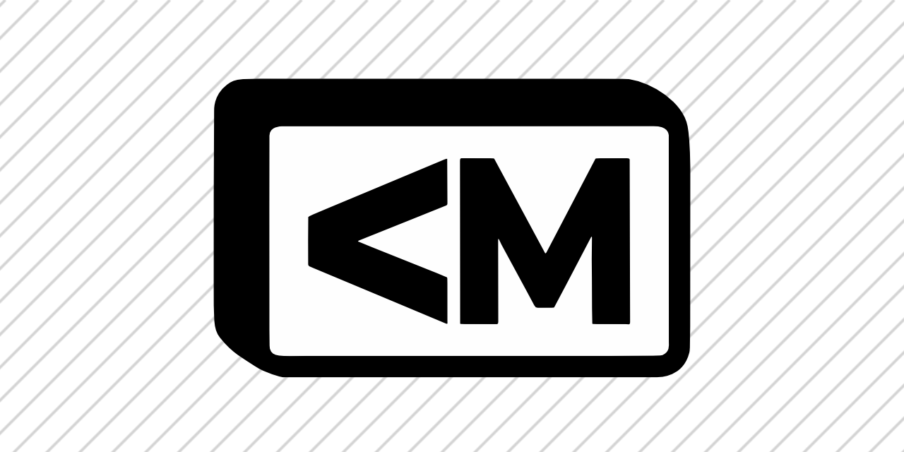

<p align="center">
  
</p>

<h1 align="center">lessmark</h1>

<p align="center">A strict, agent-readable document format for project context.</p>

Lessmark is Markdown-inspired, but built around typed blocks, a stable JSON AST, validation, formatting, and no raw HTML or JSX. It is not a drop-in Markdown renderer.

## Install

```sh
npm install lessmark
```

```sh
pip install lessmark
```

## Example

```lessmark
# Project Context

@summary
This repo builds a local Windows screenshot app.

@decision id="manual-scrolling"
Manual scrolling capture stays because apps scroll differently.

@task status="todo"
Add export settings.

@file path="src/Capture/ScrollingCaptureService.cs"
Owns stitching and capture state.
```

## CLI

```sh
lessmark parse file.lmk
lessmark check file.lmk
lessmark format file.lmk
lessmark format --write file.lmk
```

## API

```js
import { parseLessmark, validateSource, formatLessmark } from "lessmark";

const ast = parseLessmark("@summary\nTyped context for humans and agents.\n");
```

```py
from lessmark import parse_lessmark

ast = parse_lessmark("@summary\nTyped context for humans and agents.\n")
```

## V0

Lessmark v0 supports headings plus typed blocks:

`@summary`, `@decision`, `@constraint`, `@task`, `@file`, `@example`, `@note`, `@warning`, `@api`, `@link`

It rejects raw HTML, JSX, arbitrary code execution, loose paragraphs outside typed blocks, unknown block names, and unquoted attributes.

## Docs

- [V0 spec](./spec/lessmark-v0.md)
- [AST schema](./spec/ast-v0.schema.json)
- [Methodology](./docs/lessmark-methodology.md)
- [Markdown research notes](./docs/markdown-research.md)
- [Design comparison](./docs/design-comparison.md)

## License

MIT
