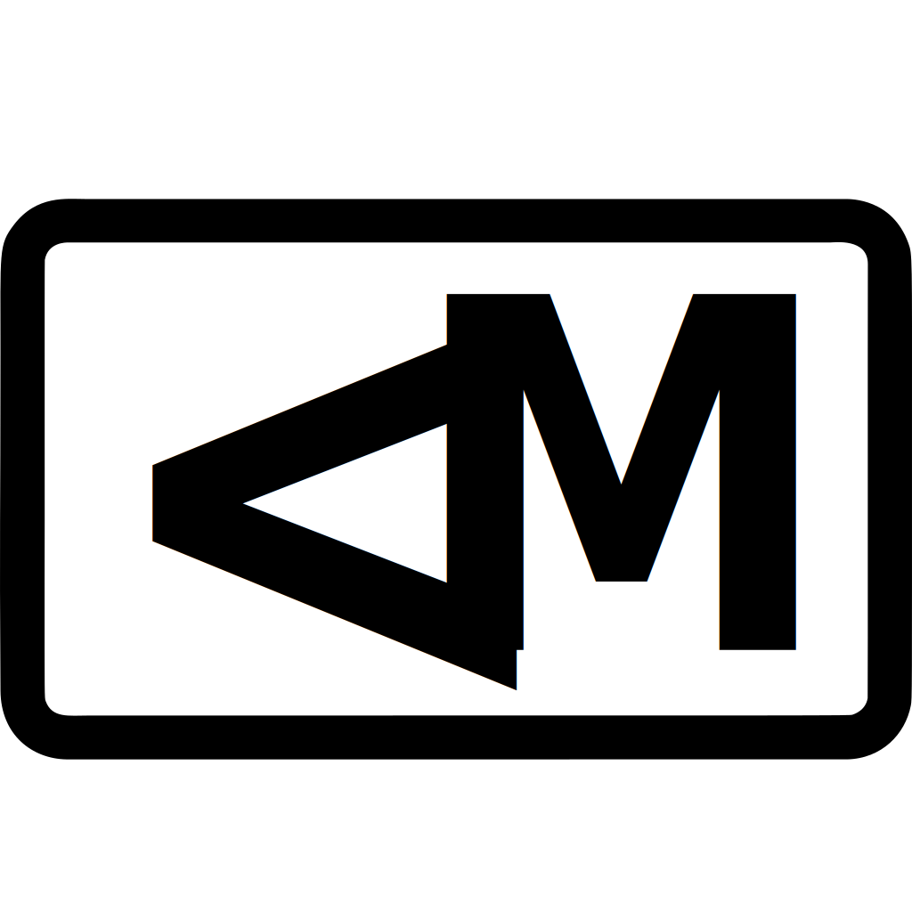

<p align="center">
  
</p>

<h1 align="center">lessmark</h1>

<p align="center">A strict, agent-readable document format for project context.</p>

Lessmark is Markdown-inspired, but it is not Markdown 2. It is a small plain-text format for agent-era documents: typed blocks, deterministic parsing, a stable JSON AST, validation, formatting, and no raw HTML or JSX.

V0 is intentionally narrow: project context, agent instructions, decisions, tasks, constraints, examples, API notes, links, warnings, and file references.

## Example

```lessmark
# Project Context

@summary
This repo builds a local Windows screenshot app.

@decision id="manual-scrolling"
Manual scrolling capture stays because apps scroll differently.

@constraint
Do not auto-scroll or auto-end capture unless the user explicitly asks.

@task status="todo"
Add export settings.

@file path="src/Capture/ScrollingCaptureService.cs"
Owns stitching and capture state.
```

## Use

```sh
npm install
npm run check
```

Parse a file:

```sh
npm exec lessmark parse examples/project-context.lmk
```

Use the library:

```js
import { parseLessmark, validateSource, formatLessmark } from "lessmark";

const source = "@summary\nTyped context for humans and agents.\n";
const ast = parseLessmark(source);
const errors = validateSource(source);
const formatted = formatLessmark(source);
```

## CLI

The `lessmark` npm package provides the `lessmark` command:

```sh
lessmark parse file.lmk
lessmark check file.lmk
lessmark format file.lmk
lessmark format --write file.lmk
```

## V0 Rules

Lessmark v0 supports:

- ATX headings: `#` through `######`
- Typed blocks: `@summary`, `@decision`, `@constraint`, `@task`, `@file`, `@example`, `@note`, `@warning`, `@api`, `@link`
- Double-quoted attributes
- Plain text block bodies
- Stable JSON AST output
- Deterministic formatting

Lessmark v0 rejects:

- Raw HTML
- JSX
- Arbitrary code execution
- Loose paragraphs outside typed blocks
- Unknown block names
- Unquoted attributes

## AST

```json
{
  "type": "document",
  "children": [
    {
      "type": "heading",
      "level": 1,
      "text": "Project Context"
    },
    {
      "type": "block",
      "name": "summary",
      "attrs": {},
      "text": "This repo builds a local Windows screenshot app."
    }
  ]
}
```

## Spec

- Preferred extension: `.lmk`
- Long-form fallback extension: `.lessmark`
- V0 spec: [`spec/lessmark-v0.md`](./spec/lessmark-v0.md)
- AST schema: [`spec/ast-v0.schema.json`](./spec/ast-v0.schema.json)

## Package Scope

Lessmark uses one npm package: `lessmark`.

PyPI and crates.io packages are optional later, only when Lessmark has official Python or Rust implementations. They are not required for the format itself.

## License

MIT
